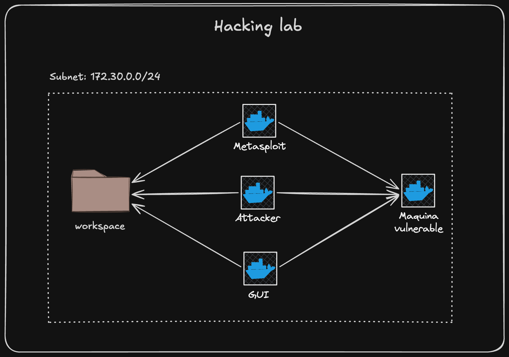

# Infra Docker Hacking Lab

<p align="center">
  
</p>

##  Quick Start

```bash
git clone https://github.com/vmonsalve/hacking-lab
cd hacking-lab
cp .env.example .env
chmod +x scripts/*.sh
chmod +x menu.sh
./menu.sh
```


Laboratorio de pentesting reproducible con Docker Compose. Incluye:
- `attacker`: contenedor con herramientas comunes de pentesting.
- `metasploit`: imagen oficial de Metasploit Framework.
- `gui`: entorno i3 accesible vía navegador (noVNC) en `http://localhost:6080/vnc.html`.

La carpeta `workspace/` se comparte entre contenedores para guardar scripts, notas y resultados.

## Requisitos

- Docker y Docker Compose v2 (`docker compose`).
- macOS: Colima o Docker Desktop. Linux: Docker estándar. Windows: WSL2 recomendado.
- Puerto libre `6080` para la GUI.

## Configuracion previa.

- Copia la configuración base:
  - `cp .env.example .env`
  
- Asegúrate de que en `.env` estén las rutas:
  - `TMUX_CONF=./config/tmux.conf`
  - `VIMRC=./config/vimrc`
  - `I3_CONFIG=./config/i3` 

### Cargar máquina objetivo

Puedes utilizar máquinas vulnerables desde 👉 https://dockerlabs.es/

#### Pasos:

1. Descarga la máquina desde DockerLabs  
2. Descomprime el archivo descargado  
3. Copia el archivo `.tar` dentro del directorio:

```bash
machines/
```

4. Carga la imagen en Docker:

```bash
docker load -i machines/artefactohackeable.tar
```

5. Verifica que la imagen fue cargada correctamente:

```bash
docker image ls
```
  Deberías ver algo como:

```text
artefactohackeable   [TAG]   <IMAGE_ID>
```
> Nota: El `[TAG]` normalmente es `latest`.

6. Con esta información, ahora debemos construir la seccion de nuestro `docker/docker-compose.yml`

```yml
  artefactohackeable:
    image: artefactohackeable:[TAG]
    container_name: artefactohackeable
    tty: true
    stdin_open: true
    networks:
      - labnet
```
En este punto ya estamos en condiciones de desplegar nuestro lab.


## Desplegando desde el menu

1. Dar permisos a los scripts alojados en el directorio `scripts`.
   ```bash
   chmod +x scripts/*.sh
   ```
2. Dar permisos al script menu.
    ```bash
    chmod +x menu.sh
    ```
3. Ejecutar menu
    ```bash
    ./menu.sh
    ```

---

<p align="center">
  
</p>

---
Una vez ejecutado, podrás controlar todo el laboratorio desde este panel interactivo.

Para iniciar tenemos dos opciones `Build containers` y `Start lab`. El primero solo crea las imagenes y el segundo crea las imagenes y despliega los contenedores.

Una vez que el proceso de desplieguie termine, presionamos enter, luego cero y salimos del menu.

## Caso de uso rapido.

```bash
docker compose exec attacker nmap -sV artefactohackeable
```

## Filosofía del proyecto

Este laboratorio no es solo para “romper cosas”, sino para:

- Entender cómo funcionan los sistemas  
- Observar comportamientos en tiempo real  
- Practicar sin depender de VMs pesadas  
- Documentar aprendizaje de forma reproducible  

---


## 👨‍💻 Autor

Vicente Monsalve  
_"Programador curioso"_ 